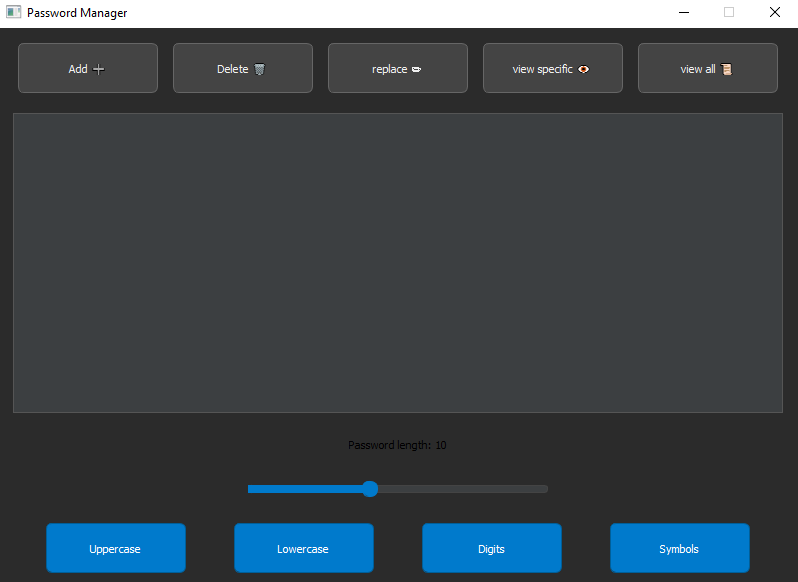
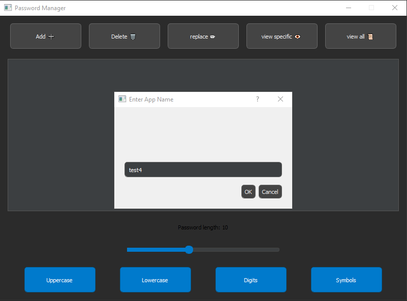
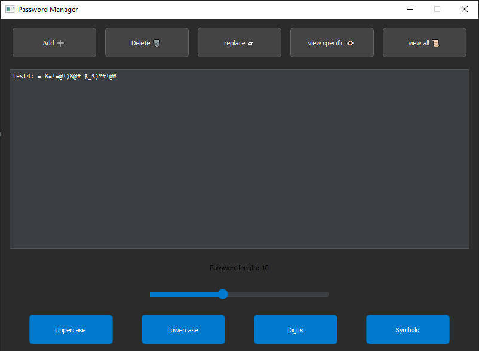

# Password-Manager

A desktop password manager built with **Python** and **PyQt5**.
Passwords are stored locally using **SQLite**

> ⚠️ **Disclaimer:**
> This project was created for learning purposes only.
> Do **not** use it to store real or sensitive passwords.

---

## Features

- Password generator with configurable length (**0-25 characters**)
- Toggle options for: 
 - uppercase letters
 - lowercase letters
 - digits
 -symbols 
- Store passwords locally in a SQLite database
- View all stored entries
- Search and display a specific entry by name
- Replace / regenerate existing passwords
- Delete stored passwords

---

## Screenshots

Add screenshots in the `docs/` folder and reference them here.

Example:





## Tech Stack

- Python 3
- PyQt5
- SQLite

---

## Installation

```bash
python -m venv .venv
source .venv/bin/activate # Windows: .venv\Scripts\activate

pip install -r requirements.txt
